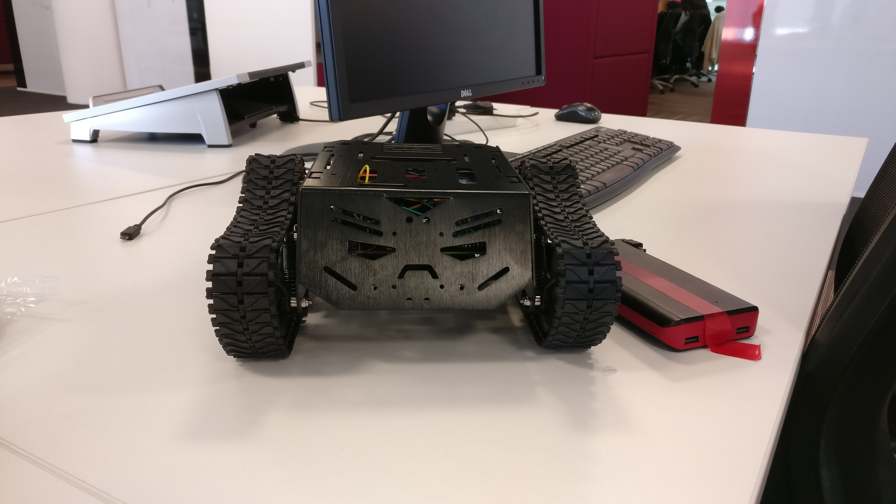
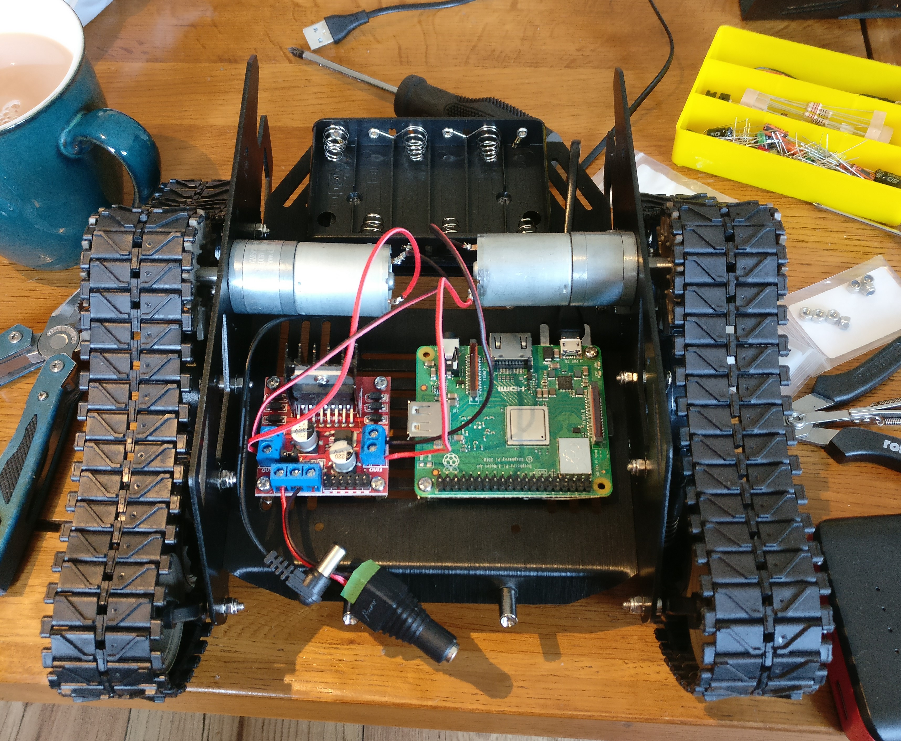

# raspberry-pi-tank

This project is the server and client app required to drive a tank via a browser.


## Prerequistes

- Raspberry Pi
- Node install on the Pi
- Connected Dual H Bridge
- Tank & motors



## Getting started

```javascript
 npm run host-mjs
```
